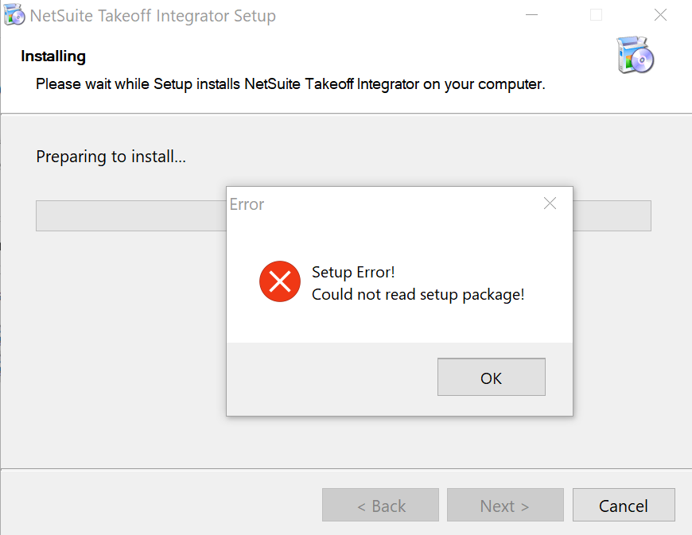
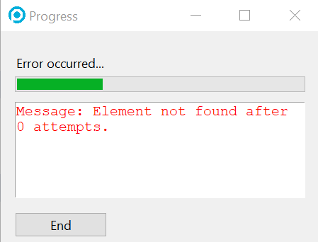
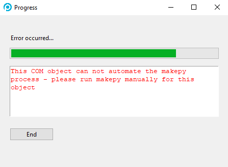
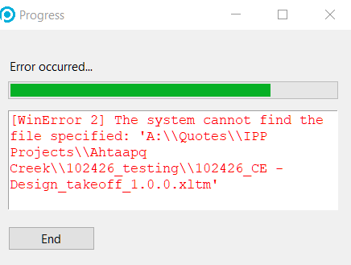
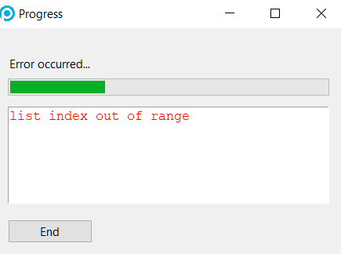
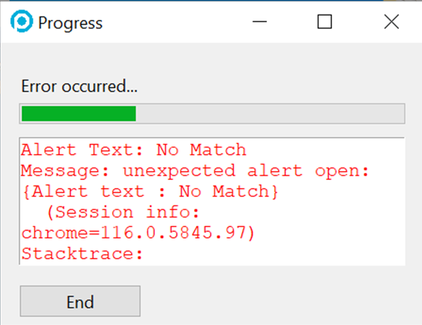
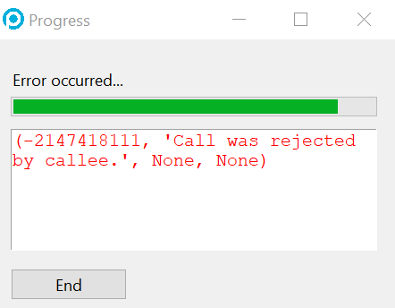

# NetSuite Takeoff Integrator
Welcome to the NetSuite Takeoff Integrator repository! The software is intended to be used by Prime Engineering Business Team to 
automatically generate proposals on NetSuite.

## Table of Contents
- [Creating the Installer](#creating-the-installer)
- [Installation](#installation)
- [Usage](#usage)
  - [Guide to First Time Running the Program](#guide-to-first-time-running-the-program)
  - [Name and Customer Fields](#name-and-customer-fields)
  - [Saving Inputs](#saving-inputs)
  - [Settings Menu](#settings-menu)
  - [Consts File](#consts-file)
  - [Switching between Sandbox and Production Environments](#switching-between-sandbox-and-production-environments)
  - [Chromedriver](#chromedriver)
  - [Chrome Settings](#chrome-settings)
- [Troubleshooting](#troubleshooting)
  - [Common Errors](#common-errors)

## Creating the Installer
To create the installer, follow these steps:
1. Clone the [netsuite-takeoff-integration](https://github.com/primeeng-adil/netsuite-takeoff-integration) GitHub repo to your local machine.
2. Run `setup.bat` in the source directory of the cloned repo. This should create two new directories, `dist` and `build` in the source directory.
3. Download and install InstallForge from [here](https://installforge.net/download/).
4. Run InstallForge and open the `config.ip` file from the source directory by clicking `File > Open` in the menu bar.
5. Add all the files in located in `dist/NetSuite Takeoff Integration/` to the **Files** section under **Setup** category on the left pane of the InstallForge by dragging and dropping them.
6. In the **Build** section under the **Build** category, choose where you want the setup to be installed.
7. Click the **Build** icon in the toolbar at the top to create an installer for the NetSuite Integrator.

## Installation
To install the integrator:
1. Get the latest installer from [here](https://github.com/primeeng-adil/netsuite-takeoff-integration/releases).
2. Install the program at desired location
3. Install chromedriver (refer to [Chromedriver](#Chromedriver))
4. Run the program!

## Usage
Using the integrator is quite simple. The only requirement is to fill in all the mandatory fields, that is all the fields
without the _'Not Required'_ label. To avoid running with incomplete inputs, the program has been designed to throw errors
if one of the mandatory field is left blank.

### Guide to First Time Running the Program
When launching the program for the first time, the following points are noteworthy:
1. Ensure you have the appropriate chromedriver installed and correctly configured in your environment variables.
2. Prior to clicking the 'Run' button, evaluate the browser's functionality by accessing Edit > Open Browser through the application's menu bar.
3. Test logging into NetSuite using the opened chromedriver browser. During login, address any security questions and select the 'Remember Me' checkbox. This enables NetSuite to remember the chromedriver browser for future sessions.
4. While the aforementioned steps usually obviate the need for Security Questions, there might be cases where NetSuite struggles to remember a user. In such scenarios, it's recommended to enter security questions and answers in their designated input fields.
5. Once you have added all the inputs, it is always a good idea to save the login and details by clicking 'Save Login' and 'Save Details' in the File menu in the menu bar at the top.

### Name and Customer Fields
The Name field is optional, while the Customer field is required. In cases where either the Name or Customer information is missing in the NetSuite system, follow these steps:
1. Access NetSuite and create a new Name or Customer entry.
2. Copy the exact name of the newly created Name or Customer.
3. Paste the copied name into the appropriate input field within the integrator.

Even though the fields are displayed as dropdowns, they are designed to accept manual inputs. It's crucial that the input matches an existing record in NetSuite precisely to ensure a successful program execution.
Please note that the dropdowns undergo updates, typically taking a day to reflect the latest changes. Consequently, any newly added customer or site will become visible in the dropdown menu on the following day. However, it's still possible to execute the program even if the corresponding record has not yet been added to the dropdown.

### Saving Inputs
You can easily store your login information and other details by using the 'Save Login/Details As...' or 'Save Login/Details' options. These two options differ mainly in terms of where your information will be stored.
- **Save Login/Details:** This option automatically saves your data to the default location: `C:\Users\<username>\Documents\Netsuite Inputs`. You can modify this default storage location by accessing the 'Settings' through `File > Settings` in the menu bar.
- **Save Login/Details As...:** With this option, you get to choose the specific folder where you want to save your information. A dialog will prompt you to select the desired location for saving.

**Remember:**
- Use the 'Save Login/Details' option alongside 'Load Login/Details.'
- Use the 'Save Login/Details As...' option in conjunction with the 'Load Login/Details As...' choice from the File menu.

> _Note: Do NOT save your login information in a public drive. Always choose to save it locally on your machine. The default location is always your local Documents folder._

### Settings Menu
You can access the settings window by clicking `File > Settings`. It allows you to change the execution speed of the program by adding a delay (in seconds) for each action. It also enables you to set default values for certain input fields so whenever you run the integrator, it will initialize those fields preloaded with the default values.
You can also set the storage location for the csv files that contain your login and details information.
By default, the values are set to:
1. **Execution Delay:** `0.0`
2. **Default CSV path:** `C:\Users\<username>\Documents\Netsuite Inputs`
3. **Status:** `Initial Review`
4. **Memo:** `2.0.0 – Base Bid`

### Consts File
Included within the program is a file named `consts.csv`, found at `<install_path>/data/consts.csv`, which houses vital runtime information utilized by the application. The `consts.csv` file showcases a table of adjustable parameters, each of which holds significance during program execution. Among these parameters, you will encounter the **NETSUITE URL** entry, important for transitioning between sandbox and production environments.
Noteworthy is the fact that upon modifying the consts file, certain OS settings may not allow you to save the changes directly within the original file. In such instances, consider the following steps:
1. Create a duplicate of the file and save it in another location. Ensure that this copy bears the exact name as the original, i.e., `consts.csv`.
2. Subsequently, substitute the original `consts.csv` with the modified duplicate, effectively replacing the original file with the modified version.

This process guarantees that the revised `consts.csv` is successfully integrated into the program's operation.

### Switching between Sandbox and Production Environments

To transition between the sandbox and production environments, follow these steps to modify the **NETSUITE URL** parameter in consts.csv. By default, the URL is set for the sandbox environment. To make the switch to the production environment, simply eliminate the `-sb1` suffix from the URL. This transformation results in a URL resembling:

`https://6516658.app.netsuite.com/app/common/custom/custrecordentry.nl?rectype=207`

And to switch back to sandbox environment, reinstating the `-sb1` suffix in the **NETSUITE URL** accomplishes the switch effectively. For example:

`https://6516658-sb1.app.netsuite.com/app/common/custom/custrecordentry.nl?rectype=207`

### Chromedriver
Think of Chromedriver as the powerhouse of the NetSuite Takeoff Integrator. It's like a specialized version of the Chrome browser designed by developers for tasks like automation and testing. It's what makes the integrator tick and allows different parts to work together smoothly.

#### Installing Chromedriver

For a seamless installation of chromedriver, follow these steps:
1. **Determine Chrome Browser Version:** Begin by verifying your Chrome browser version. Access `Chrome > Help > About Google Chrome` to find this information.
2. **Download the Appropriate chromedriver:** Visit [this link](https://googlechromelabs.github.io/chrome-for-testing/) and download the suitable chromedriver. Ensure that you're downloading chromedriver, not the Chrome browser itself. Match the major version of the chromedriver with your Chrome browser version.
3. **Extract to Destination:** Unzip the downloaded file and place its contents in `C:\Program Files (x86)`.
4. **Add to System Path:** Add the path of the chromedriver folder to the `Path` variable within System Variables in your Environment Variables.

**Points of Emphasis:**

1. **Version Compatibility:** Always verify the chromedriver version for compatibility with your Chrome browser. Confirm your Chrome version via `Chrome > Help > About Google Chrome`.
2. **Reboot for Changes:** After adding the chromedriver path to your environment variables, reboot your computer to ensure the changes take effect.

> _Note: During the runtime of the application, it is important to NOT interact with the Chromedriver browser. However, you may continue doing other
> stuff on your machine and that includes your home browser._

### Chrome Settings
The only Chrome browser settings that might interfere with the chromedriver is if you have different On Startup settings. To check your On Startup settings, go to `Chrome > Settings > On Startup`. Make sure that you have the `Open New Tab Page` option selected. 

## Troubleshooting
As the program interfaces with a dynamic browser environment, it's crucial to prevent any concurrent user interactions within the same browser session. Unexpected crashes might occur due to the inherently unpredictable state of the browser. Should such crashes arise, the subsequent steps will aid in effective troubleshooting:
1. **Restart and Rerun:** If the program crashes, start by relaunching the program and executing it again. Ensure the closure of all related program windows for a complete reset.
2. **Iterative Restart:** If the program crashes consecutively, consider restarting the application. Introduce a delay of approximately 0.5 seconds, allowing you to observe potential breakpoints. Frequent program crashes often result from typographical errors or the absence of specific inputs in the NetSuite database.
3. **Validate Data Existence:** Prior to program execution, verify the existence of both the Customer and Name entries in the relevant NetSuite environment. Precision matters; double-check that the correct NetSuite environment—such as sandbox if applicable—is being used to check the records. Mismatches can lead to errors.

By adhering to these troubleshooting steps, you can enhance the reliability of the program's execution and minimize the likelihood of unexpected crashes.

### Common Errors
This section outlines a description of the most common errors encountered.

If you encounter this error while attempting to run the setup, it's likely due to the setup file being located on a network drive. To resolve this, follow these steps:
1. **Move Setup:** Copy the setup files from the network drive to your local machine.
2. **Run Setup:** Run the setup from your local drive.

Encountering this error indicates that the program is unable to locate a specific element on the NetSuite page. A potential reason could be a change in the input field's id/name. To address this issue effectively, follow these steps:
1. **Introduce Execution Delay:** Add a slight delay to the program's execution. This allows you to pinpoint the exact point of failure, potentially highlighting which element (input field) is causing the issue.
2. **Element ID Check:** Once you've identified the problematic element, cross-reference its id/name with the one specified in the program's source code. Ensure that they match precisely.

This error emerges when the program detects that one of the Excel files it relies upon is already open on your machine. To address this issue, take the following steps:
1. **File Closure:** Ensure that the Excel file in question is closed on the system where the program is running.
2. **Exclusive Access:** For smooth program operation, it's essential that the Excel files are not concurrently open across multiple instances or users.

If you encounter this error, it signifies a disruption in your connection to the network drive, often associated with the A drive. To resolve this issue, follow these steps:
1. **Check Network Connection:** Ensure that you have a stable and active connection to the required network drives, including the A drive.
2. **Reconnect Network Drives:** If the connection is lost, attempt to reconnect the network drives associated with the program's operation.

Should you encounter this error, it indicates potential disruptions to the chromedriver – often stemming from user interactions. To address this, implement the following steps:
1. **Exit and Rerun:** If the chromedriver's functionality is compromised, exit the program and rerun it. Crucially, refrain from interacting with the browser during the program's execution.
2. **Browser Performance Consideration:** In some instances, this error could arise due to the browser's inability to match the program's speed. To mitigate this, consider introducing a slight delay into the program's execution.

Encountering this error signifies that NetSuite is unable to locate the value for one of the input fields. To rectify this issue, implement the following steps:
1. **Validate Input Accuracy:** Ensure that all input values provided are accurate and correspond to existing records within NetSuite, particularly in the relevant environment.
2. **Introduction of Delay:** To isolate the input responsible for the error, introduce a delay into the program's execution. This step can help identify which specific input is causing the issue.

Should this error surface during Quote Log entry, it typically signifies that the Quote Log is currently being accessed by another user. To address this situation, consider the following:
1. **Concurrent Access:** Check whether the Quote Log is currently being used by another individual. Collaborative access to the Quote Log by multiple users can lead to this error.
2. **Wait and Retry:** If you suspect simultaneous access is causing the issue, wait for a brief period before attempting to access the Quote Log again. This provides time for the current user to complete their task.